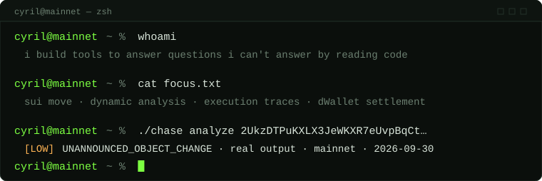
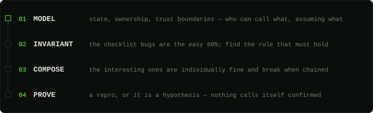
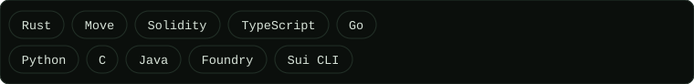

# CYRIL

**I build tools to answer questions I can't answer by reading code.**

Security work isn't a checklist. It's modeling a system until you understand its invariants well enough to
know exactly where they'll break. Almost everything below exists because I hit a wall doing research by hand
and wrote something so the wall wouldn't move again.

---

## 01 · NOW BUILDING — `chase`

[](https://www.npmjs.com/package/@zeroxcyril/chase)

[](https://github.com/0xCyrildev/Chase/blob/main/LICENSE)

Dynamic analysis for Sui Move transactions. You give it a digest; it pulls the execution trace that actually
happened over gRPC, resolves the signature of every `MoveCall` in the block, runs **11 invariant checks**
against it, and reduces what fired into a deterministic priority tier. Reverted transactions are analysed in
full — an attempt that failed on chain is still an attempt.

It ships as a CLI, a library and an MCP server, so a person can run it, a script can import it, and an agent
can call it under an explicit budget. What it emits is a **triage signal with the arithmetic trail attached**,
never a verdict: a clean report means one transaction didn't do these things, not that a package is safe.

```bash
npm i -g @zeroxcyril/chase
chase analyze <TX_DIGEST>
```

→ [`0xCyrildev/Chase`](https://github.com/0xCyrildev/Chase) · the README quotes real output and the
denominator each rate was measured against.

## 02 · HOW I BREAK THINGS



The composed bugs are the ones worth finding: individually reasonable calls that break when you chain them
across transactions, across modules, across chains. I would rather spend an extra hour understanding *why*
something is safe than assume it is because nothing on a list flagged it.

## 03 · THE ARSENAL

| Tool | What it is, and the reason it exists |
|---|---|
| [`chase`](https://github.com/0xCyrildev/Chase) | Dynamic analysis for Sui Move — traces → invariants → triage → scout. Source review cannot see what a transaction did on chain. |
| [`sui-invariant-fuzzer`](https://github.com/0xCyrildev/sui-invariant-fuzzer) | Property-based fuzzer for Sui Move. A shrinker that actually delta-debugs beats one that backs off randomly. |
| [`sui-sec`](https://github.com/0xCyrildev/sui-sec) | Static bytecode scanner for Sui Move — ability drift, unsafe entry points, premature UID deletion. Invisible unless you diff bytecode against source. |
| [`necropsy`](https://github.com/0xCyrildev/necropsy) | Post-exploit forensics for EVM. Reading a block explorer after a hack is not how you find out what happened. |
| [`echo`](https://github.com/0xCyrildev/echo) | Conflict scanner for Monad's parallel execution. Found its own 97.5% false-conflict rate mid-build — a tracer misconfiguration. Fixing it taught me more than the spec did. |
| [`rouge-kali`](https://github.com/0xCyrildev/rouge-kali) | Audit workflow framework for AI agents, with a confidence gate that refuses to let a finding call itself "confirmed" without a passing local PoC. |
| [`flank`](https://github.com/0xCyrildev/flank) | Recon for oracle architecture risk and RPC misconfiguration, EVM and Sui. Half of what breaks is configuration nobody drew a boundary around. |

<details>
<summary>Also poking at — honeypy, malware-analyzer, ssh-honeypot, polymorphic-engine, THE-MATRIX</summary>

The defensive-systems side: honeypots that log what actually gets attempted against them
([`honeypy`](https://github.com/0xCyrildev/honeypy),
[`ssh-honeypot`](https://github.com/0xCyrildev/ssh-honeypot)), a
[`malware-analyzer`](https://github.com/0xCyrildev/malware-analyzer), a polymorphic code engine, and
[`THE-MATRIX`](https://github.com/0xCyrildev/THE-MATRIX). Built to understand the other team's tooling by
rebuilding it.

</details>

## 04 · RECEIPTS

- [`Audit-Reports`](https://github.com/0xCyrildev/Audit-Reports) — audits conducted on EVM and Move protocols.
- [`research-log`](https://github.com/0xCyrildev/research-log) — the running notes, including the ones where
  the hypothesis lost.
- [`inkswap-monad-hackathon`](https://github.com/0xCyrildev/inkswap-monad-hackathon) — InkSwap, a gasless
  cross-chain swap protocol with dWallet-signed settlement on Monad.

## 05 · CURRENTLY CURIOUS

Cross-chain systems that decouple signing from settlement. Threshold-signature architectures, MPC
coordination, and where the failure modes hide when a system has no single-chain liveness assumption to lean
on. Same question as everything else I work on: what does this system assume is always true, and what happens
the one time it isn't.

## 06 · STACK



## 07 · OFF CLOCK

Anime, games, and basketball. If you have tips for my bag, tell me please — I am also taking anime
recommendations.

## 08 · FIND ME

Always interested in a hard bug or an interesting systems question.

[](https://x.com/zeroxcyril_)
[](https://t.me/zeroxCyril)
